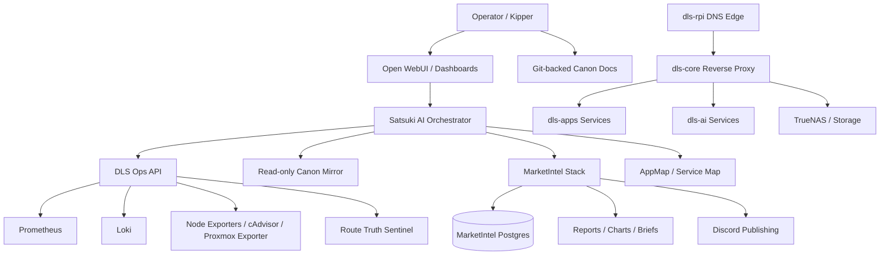

# 📀 DLaBS — Decentral Labs Homelab

> **A self-hosted AI, observability, automation, media, storage, and market-intelligence lab built around one rule:**  
> **own the stack, understand the stack, and make the stack observable.**

---

## 🧭 Overview

**DLaBS** is my personal homelab and research estate. It combines traditional infrastructure, self-hosted services, AI orchestration, market-intelligence tooling, private documentation, and observability into one continuously evolving platform.

The project is intentionally practical:

- run useful services at home;
- keep the network boring and reliable;
- document changes as they happen;
- expose enough telemetry for fast debugging;
- build Satsuki, an AI operator that can understand the lab from live metrics, source indices, and canon docs;
- experiment with finance, macro, crypto, and prediction-market research in a **read-only / paper-only / fail-closed** way.

This repository is the public-safe front door for the DLaBS project.  
Sensitive details such as private IPs, credentials, API keys, Tailnet identifiers, and secret-bearing configs are intentionally excluded.

---

## ⚠️ Safety / Scope Notice

DLaBS contains research systems that analyze markets, charts, macro data, crypto data, and prediction markets.

**Nothing in this project is financial advice.**  
MarketIntel and Polymarket-related components are research tools only unless explicitly documented otherwise.

Current default posture:

| Area | Status |
|---|---|
| Live trading | ❌ Disabled |
| Wallet actions | ❌ Disabled |
| CLOB / order placement | ❌ Disabled |
| Paper trading | 🧪 Controlled / gated |
| Charting | ✅ Read-only |
| Market reports | ✅ Read-only |
| AI summaries | ✅ Read-only unless explicitly changed |
| Secrets in docs | ❌ Never printed |

---

## 🏗️ Estate Philosophy

DLaBS follows a few core operating rules:

1. **🧱 Uniform paths**
   - Prefer predictable `/opt/dls-*`, `/srv/nodeapps`, and documented service paths.
   - Avoid random one-off install locations.

2. **🛡️ Backup before edits**
   - Config and code changes should create timestamped backups first.
   - Rollback notes belong in the same event/runbook.

3. **👀 Observable by default**
   - Services should expose health checks, logs, metrics, or status JSON where practical.
   - “It works” is not enough; it should be explainable.

4. **🔒 Secrets never printed**
   - No raw `.env` dumps.
   - No unredacted API keys, tokens, webhook URLs, LiteLLM keys, Discord secrets, or rendered secret-bearing compose configs.

5. **🧭 Source-of-truth priority**
   - Current live correction
   - Live validation / telemetry
   - Git-backed canon
   - Baseline docs
   - Older archived context

6. **🧯 Fail closed**
   - If a trading, wallet, auth, or secret path is uncertain, block it first and explain the safe path.

---

## 🧠 What DLaBS Runs

DLaBS is split into functional layers.



---

## 🖥️ Main Nodes

> Public README note: hostnames are descriptive. Private addresses and secret-bearing details are omitted.

| Node | Role | Notes |
|---|---|---|
| **dls-prox** | Proxmox / virtualization host | Runs the VM estate and hardware-backed services. |
| **dls-core** | Reverse proxy / core routing | Caddy, dashboard routing, internal TLS, LAN app entrypoints. |
| **dls-ai** | AI + MarketIntel | Satsuki orchestrator, LiteLLM, Open WebUI, MarketIntel, charting, reports. |
| **dls-ops** | Observability + bridge API | Prometheus, Loki, Grafana, exporters, Satsuki telemetry bridge. |
| **dls-apps** | Self-hosted apps + canon repo | SearXNG, code-server, Linkding, AppMap, Paperless, Audiobookshelf, Changedetection, Actual Budget. |
| **dls-rpi** | DNS edge | Pi-hole, Unbound, local DNS stability, boring/reliable network foundation. |
| **dls-nas** | Storage | TrueNAS SCALE / Community storage backend. |
| **dls-media** | Media workload | Plex-focused media role. |
| **heero / mash** | Workstations | Operator/gaming/desktop systems. |

---

## 🧬 Satsuki

**Satsuki** is the AI operator layer for DLaBS.

The goal is not just “chat with an LLM.”  
The goal is an AI assistant that can understand the estate through:

- live service health;
- route truth checks;
- metrics and logs;
- source-indexed code/config snapshots;
- Git-backed canon events;
- MarketIntel reports;
- controlled fastpaths for common DLaBS questions.

### Current Satsuki capabilities

| Capability | Description |
|---|---|
| **Orchestrator API** | Central FastAPI service for routing AI, ops, and MarketIntel requests. |
| **Open WebUI integration** | User-facing chat interface. |
| **LiteLLM routing** | Model routing and API-compatible completion paths. |
| **Ops bridge** | Reads summarized dls-ops health/telemetry through safe API endpoints. |
| **Canon mirror** | Reads Git-backed DLaBS canon from a read-only synced context. |
| **Secret-safety fastpath** | Refuses diagnostics that would expose secrets and suggests safe alternatives. |
| **Chart-link fastpath** | Generates read-only chart links for supported MarketIntel symbols/timeframes. |
| **DLS app awareness** | Knows app health, route/backend mismatches, and service summaries through bridge data. |
| **MarketIntel summaries** | Can summarize paper trading, macro, funding, positioning, charts, and research reports. |

---

## 📊 MarketIntel

MarketIntel is the DLaBS research stack for market data, macro signals, charts, paper-trading diagnostics, and prediction-market research.

### Core principles

- read-only first;
- paper-only when explicitly gated;
- no wallet actions;
- no live order execution;
- no promotion from research to execution without evidence and documented gates.

### Major areas

| Area | Description |
|---|---|
| **OHLCV data** | Crypto and equity candles for research/backtests. |
| **Chart dashboard** | Read-only TradingView-style chart interface. |
| **World Macro Daily** | Daily macro reports with US/Canada emphasis. |
| **Paper trading** | Controlled forward-test and scorecard tooling. |
| **Funding rates** | Crypto funding-rate pressure summaries. |
| **Leverage positioning** | Binance USD-M positioning pressure summaries. |
| **Polymarket research** | Resolved-market scoring, replay diagnostics, source calibration, simulator scaffolding. |
| **Discord reports** | Sanitized summaries and chart bundles posted to Discord. |

### Example MarketIntel posture

```text
trading_allowed=false
execution_enabled=false
wallet_actions_enabled=false
clob_order_placement_enabled=false
paper_execution_enabled=gated
live_execution_enabled=false
```

---

## 🌐 Self-hosted Apps

DLaBS runs a growing app layer behind internal routing.

| App | Purpose |
|---|---|
| **SearXNG** | Private metasearch |
| **code-server** | Browser-based coding workspace |
| **Linkding** | Bookmark management |
| **AppMap** | Visual app/service map |
| **Paperless-ngx** | Document management |
| **Audiobookshelf** | Audiobooks/podcasts |
| **Changedetection** | Webpage change monitoring |
| **Actual Budget** | Budgeting |
| **Homepage** | Dashboard |
| **Uptime Kuma** | Service uptime checks |
| **Dozzle** | Container logs |
| **Glances** | Host monitoring |
| **Portainer** | Docker management |

---

## 📡 Observability

DLaBS uses observability as an operating layer, not an afterthought.

### Main components

| Component | Purpose |
|---|---|
| **Prometheus** | Metrics collection |
| **Grafana** | Dashboards |
| **Loki** | Logs |
| **Alloy** | Log/telemetry forwarding |
| **node-exporter** | Host metrics |
| **cAdvisor** | Container metrics |
| **Proxmox exporter** | Hypervisor metrics |
| **Blackbox probes** | HTTP/TCP reachability checks |
| **DLS Ops API** | Summarized health bridge for Satsuki |
| **Route Truth Sentinel** | Distinguishes backend health from routed hostname health |

### Route Truth Sentinel idea

A recurring issue in homelabs is this:

> “The app is up, but the URL is down.”

DLaBS tracks both sides:

- backend service health;
- routed hostname health;
- DNS state;
- TLS / proxy state;
- mismatch classification.

This lets Satsuki say things like:

```text
The backend is healthy, but the routed hostname is failing at the proxy layer.
Check the dls-core Caddy route for this service.
```

---

## 🧾 Canon / Documentation System

DLaBS uses a Git-backed living canon instead of scattered notes.

The canon stores:

- architecture docs;
- event logs;
- runbooks;
- source-index packets;
- node inventories;
- decisions;
- baselines;
- handoffs;
- troubleshooting notes.

### Documentation doctrine

Every meaningful change should answer:

| Question | Example |
|---|---|
| What changed? | Service, config, route, timer, script, report, or node behavior. |
| Where did it change? | Host and exact path. |
| Why did it change? | Incident, feature, cleanup, hardening, or repair. |
| What proved it worked? | Health check, syntax validation, service status, HTTP response, report output. |
| How can it roll back? | Backup path, previous commit, old config, or known revert command. |
| Is it safe for Satsuki? | Secret-free, source-indexed, or metadata-only. |

---

## 🗂️ Example Repository Layout

This repo may vary over time, but the DLaBS documentation structure generally follows this pattern:

```text
.
├── README.md
├── baselines/
│   ├── DLS_ULTRA_CANON_v4_Current_Baseline.md
│   └── ...
├── decisions/
│   └── ...
├── events/
│   └── YYYY/
│       └── MM/
│           └── YYYYMMDDTHHMMSSZ-event-name.md
├── handoffs/
│   └── ...
├── inventory/
│   └── ...
├── nodes/
│   ├── dls-ai/
│   ├── dls-apps/
│   ├── dls-core/
│   ├── dls-ops/
│   ├── dls-prox/
│   ├── dls-rpi/
│   └── dls-nas/
├── runbooks/
│   └── ...
├── scripts/
│   └── ...
├── source-index/
│   ├── dls-ai/
│   ├── dls-core/
│   ├── dls-apps/
│   └── ...
└── utilities/
    └── ...
```

---

## 🔐 Secret Handling

DLaBS documentation and AI workflows treat secrets as toxic output.

### Never commit or print

- `.env` contents;
- API keys;
- Discord bot tokens;
- webhook URLs;
- wallet keys;
- LiteLLM keys;
- Tailscale auth keys;
- rendered Docker Compose configs containing secrets;
- raw application configs with embedded credentials.

### Preferred safe validation

Instead of printing secrets:

```bash
# ✅ Safe-ish: prove a file exists without printing contents
sudo test -f /path/to/secret.env && echo "secret_file_seen=yes"

# ✅ Safe-ish: show permissions without values
sudo stat -c '%U:%G %a %n' /path/to/secret.env

# ✅ Safe-ish: show a fingerprint only when needed
sudo sha256sum /path/to/secret.env | awk '{print "sha256=" $1}'
```

---

## 🧰 Operational Style

DLaBS commands are designed to be copy/paste-safe and host-aware.

A good DLaBS maintenance block should usually include:

1. host guard;
2. backup path;
3. exact target path;
4. change;
5. syntax validation;
6. service restart;
7. health check;
8. rollback note.

Example pattern:

```bash
set -euo pipefail

EXPECTED_HOST="dls-example"
ACTUAL_HOST="$(hostname -s)"

if [ "$ACTUAL_HOST" != "$EXPECTED_HOST" ]; then
  echo "REFUSING: expected host $EXPECTED_HOST but got $ACTUAL_HOST"
  exit 1
fi

echo "host_guard_ok=$ACTUAL_HOST"
echo "target=/opt/dls-example/config/example.conf"

sudo cp -a /opt/dls-example/config/example.conf \
  /opt/dls-example/config/example.conf.bak.$(date -u +%Y%m%d-%H%M%S)

# Apply change here.

sudo systemctl restart dls-example.service
sudo systemctl is-active dls-example.service
```

---

## 🧪 Current Research Tracks

### 1. Satsuki as a better lab operator

Goal: make Satsuki more aware of live DLaBS state without exposing secrets.

Planned improvements:

- better route/backend mismatch explanations;
- richer dls-ops summaries;
- tighter source-index line references;
- safer config-aware diagnostics;
- estate-wide “what changed recently?” summaries.

### 2. MarketIntel evidence gates

Goal: improve data quality, simulation quality, and safety gates before any execution path exists.

Current emphasis:

- paper-only diagnostics;
- Polymarket resolved-market scoring;
- simulator repeat validation;
- false-positive reduction;
- chart/report explainability.

### 3. WebUI / dashboard revamp

Goal: build a navigable DLaBS UI with separate zones for:

- estate health;
- Satsuki conversations;
- app inventory;
- route truth;
- finance/macro/market agents;
- charts and reports;
- incident history;
- canon events.

### 4. Source-indexed canon

Goal: let Satsuki reference safe, line-numbered source/config snapshots.

Example target answer:

```text
The route is failing because the Caddy route for that hostname points to the wrong backend port.
See source-index/dls-core/Caddyfile around the relevant route block.
```

---

## 🧱 Technology Stack

DLaBS uses a mix of practical infrastructure and research tooling.

| Category | Tools |
|---|---|
| Virtualization | Proxmox |
| Storage | TrueNAS SCALE / Community, ZFS |
| Networking | Pi-hole, Unbound, Caddy, Tailscale, WireGuard/Mullvad where appropriate |
| Containers | Docker, Docker Compose |
| AI | Open WebUI, LiteLLM, Ollama-compatible local models, custom FastAPI orchestrator |
| Observability | Prometheus, Grafana, Loki, Alloy, exporters |
| Apps | SearXNG, Linkding, Paperless-ngx, Audiobookshelf, Changedetection, Actual Budget, Homepage |
| Data | PostgreSQL, Redis, Qdrant |
| Market research | OHLCV pipelines, macro ingest, chart renderer, paper-trading scorecards, Polymarket analytics |
| Docs | Git, Obsidian-style markdown canon, source-index packets |

---

## 📸 Screenshots

Add screenshots here as the public UI stabilizes.

```text
docs/assets/screenshots/
├── homepage.png
├── appmap.png
├── satsuki-open-webui.png
├── grafana-overview.png
├── marketintel-chart-dashboard.png
└── paper-status.png
```

Example markdown:

```md


```

---

## 🚦 Project Status

DLaBS is active and evolving.

| Layer | Status |
|---|---|
| Core routing | ✅ Operational, continuously hardened |
| DNS edge | ✅ Operational, reliability-focused |
| App layer | ✅ Operational |
| Observability | ✅ Operational, expanding |
| Satsuki AI operator | 🧪 Operational, actively evolving |
| Canon docs | ✅ Git-backed living docs |
| Source-index layer | 🧪 Expanding |
| MarketIntel charts/reports | ✅ Operational |
| Paper trading | 🧪 Gated |
| Polymarket simulator | 🧪 Research-only |
| Live trading | ❌ Disabled |

---

## 🗺️ Roadmap

### Near term

- [ ] Continue source-index coverage for major nodes.
- [ ] Improve Satsuki’s line-aware diagnostics.
- [ ] Expand route truth and service health summaries.
- [ ] Build richer DLaBS web dashboard sections.
- [ ] Continue MarketIntel research without enabling live execution.
- [ ] Improve canon event hygiene and automated rollups.

### Medium term

- [ ] Better staging workflow for dls-ai changes.
- [ ] Safer restore/backups for key AI and MarketIntel services.
- [ ] More complete Grafana dashboards.
- [ ] More useful MarketIntel simulator diagnostics.
- [ ] Stronger “what changed recently?” assistant context.

### Long term

- [ ] Dedicated Satsuki hardware / “brain” node.
- [ ] Deeper estate-wide AI awareness.
- [ ] More polished public documentation.
- [ ] Mature internal DLaBS portal.
- [ ] Fully reproducible disaster recovery docs.

---

## 🤝 Contribution Notes

This is primarily a personal homelab project, but the structure may be useful for others building:

- AI-assisted homelabs;
- self-hosted observability stacks;
- Git-backed infrastructure documentation;
- safe AI operator workflows;
- private market-research labs;
- LAN-first service maps.

Public contributions should avoid:

- secrets;
- private addresses;
- personal tokens;
- credential-bearing configs;
- anything that enables unsafe trading or wallet actions.

---

## 🧾 License

License is TBD.

Until a license is explicitly added, assume:

```text
All rights reserved.
```

---

## 🧠 Closing Note

DLaBS is not just a pile of containers.

It is an attempt to build a self-hosted operating environment where infrastructure, AI, observability, documentation, and research all reinforce each other.

The end goal:

> **A lab that can explain itself.**
