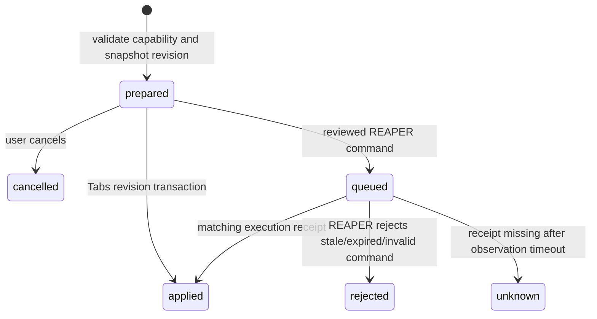

# Shared DLS / Satsu contract

Protocol: **dls-action/1**. This release has two actual adapters: Tabs (score resources) and Studio (REAPER session resources). They share accounts, actions, artifacts, revisions and receipts. This contract is an extension point for additional DLS apps, not a claim that uninspected apps have been connected.

## Context and identity

Tabs resources use a score UUID and an integer revision. Studio uses an opaque session key tied to the master track and current bridge run, with REAPER's state-change count as its revision. A fresh bridge context is required and expires after five seconds without observation. Audio position and meters are observations, not a sample-accurate sync bus.

Each prepared action stores:

```json
{
  "id": "generated-action-uuid",
  "user_id": "authenticated-account-id",
  "app": "tabs",
  "resource": "score-id",
  "revision": "3",
  "operation": { "type": "tempo", "value": 84 },
  "description": "Set Glass to 84 BPM",
  "status": "prepared",
  "receipt": null,
  "created": "ISO timestamp"
}
```

The server supplies IDs, account, resource revision and description. Clients cannot choose the expected revision of a prepared action or impersonate another user. Direct editor PATCH requests instead require their own expected revision.

## Lifecycle



A stale apply returns HTTP 409 and leaves the proposal prepared for inspection or cancellation. Prepare again against fresh context rather than changing its stored revision. Reapplying an existing action returns its current state; it does not repeat a score mutation or queue another command. Tabs update, revision record, and action receipt commit in one SQLite transaction. Import acceptance similarly creates its score and marks its artifact accepted in one transaction.

Studio's filesystem boundary cannot atomically commit both the database and a DAW change. Commands are claimed before execution, receipts are durable, and repeated IDs are not executed again by Lua. A `processing-*` file blocks additional commands. Unknown outcomes require operator inspection; no compensating command or blind retry is generated.

After an unknown outcome, a later valid receipt reconciles the action on the next ledger poll. The observation timeout starts when a reviewed command is queued, not when its review was first prepared. Do not delete or replay old command/processing/receipt files to make the UI look complete.

## Endpoints

All app endpoints require a valid HttpOnly session. Write endpoints also check browser origin and JSON/multipart content type. There is no permissive CORS route. Use a same-origin browser integration or a trusted server-side adapter. Owners have mutation permissions; guests have personal-practice permissions only.

| Request                        | Purpose                                                         |
| ------------------------------ | --------------------------------------------------------------- |
| `GET /api/capabilities`        | Supported apps, operations and endpoint contract                |
| `GET /api/connections`         | Storage, model route configuration, live REAPER observation     |
| `GET /api/scores/:id`          | Full supported score model, revision and user preference        |
| `POST /api/satsu/ask`          | Advice artifact with context resolved by the server             |
| `POST /api/actions/prepare`    | Validate operation, bind current context, store proposal        |
| `POST /api/actions/:id/apply`  | Explicit reviewed apply; validate source again                  |
| `POST /api/actions/:id/cancel` | Cancel a prepared proposal                                      |
| `GET /api/actions/:id`         | Current status and receipt                                      |
| `GET /api/actions`             | Current account's recent action ledger                          |
| `GET /api/artifacts`           | Account's imports, audio measurements, advice and MIDI handoffs |
| `POST /api/scores/:id/handoff` | Snapshot MIDI with source score identity and revision           |
| `GET /api/artifacts/:id/midi`  | Download the account's specific MIDI snapshot                   |

Score operations: `note`, `tempo`, `metadata`. Note selection is addressed explicitly by zero-based track/staff/bar/voice/beat/note indices. Only fretted notes are changed. Fret is 0–36; string must be within the instrument tuning. Tempo is 20–300 BPM and can target a master bar (default first bar).

REAPER operations: `play`, `pause`, `stop`, `mute`, `solo`, `volume`, `loop`, `marker`. Track identity is GUID-based. Volume is linear amplitude 0–2; loops and markers use project seconds in 0–86400. Loop ranges change the selected range; they do not automatically enable REAPER's repeat toggle. No arbitrary REAPER action IDs, shell commands, plugin execution or file-path operations are exposed.

## Example adapter

Use `sdk/dls-client.mjs` from a trusted backend or same-origin browser. It keeps login session state in memory; it does not persist passwords or tokens.

```js
import { DlsClient } from "./sdk/dls-client.mjs";

const dls = new DlsClient(process.env.DLS_ORIGIN);
await dls.login(process.env.DLS_USER, process.env.DLS_PASSWORD);
const capabilities = await dls.capabilities();
const score = await dls.score("demo-1");
const proposal = await dls.prepare("tabs", score.id, {
  type: "tempo",
  value: 84,
});

// Display proposal.description, resource, revision and operation to the user.
// Call only after an explicit review in the integrating application's UI.
await dls.applyReviewed(proposal.id);
const receipt = await dls.receipt(proposal.id);
await dls.logout();
```

Do not put owner credentials in frontend bundles or make `applyReviewed` an ungated autonomous AI tool. The built-in Satsu model route receives advice context only and has no execution tools. An external SatsuOS adapter must preserve your own authorization and review policy. Future narrower service credentials should be implemented before granting headless agents control of this host.

## Model route adapter

Configuration is host-side: `SATSU_BASE_URL`, `SATSU_MODEL`, optional `SATSU_API_KEY`. The server calls an OpenAI-compatible `/chat/completions` endpoint with a 45-second deadline and bounded output. Requests contain the user's request plus resolved score/session summary. Track context is capped at 64 entries. Related score summaries are labelled as unconfirmed DAW relationships.

This adapter does not discover a private SatsuOS API, emulate its policy engine, or fabricate a live model connection. Its unconfigured state returns labelled local workflow templates. Replace `server/satsu.mjs` with a specific SatsuOS gateway adapter once its real endpoint/auth/context contract is supplied.

## Failure and recovery

- A disconnected REAPER adapter permits Tabs work and WAV measurement. DAW mutations are unavailable until fresh context arrives.
- A missing model route permits local editing and template advice. It never invents AI-generated output.
- An import runs in an isolated worker with a ten-second deadline and bounded heap. Limits are 8 MB, 32 tracks, 2,000 bars and 100,000 beats; two imports can be processed at once.
- An owner can restore a prior Tabs source into a new revision. Shared-source rollback does not delete later revision history or change personal practice records.
- REAPER mutations use native undo. The service never attempts automatic rollback of a command with an unknown outcome.
- Bridge folders and receipts are trusted local filesystem data. Provision their OS permissions as deliberately as the DAW session. The suite does not expose a remote endpoint for uploading arbitrary spool files.

Back up the application database and REAPER projects separately. Audio callback timing, sample processing and MIDI event timing remain in their music engines.
